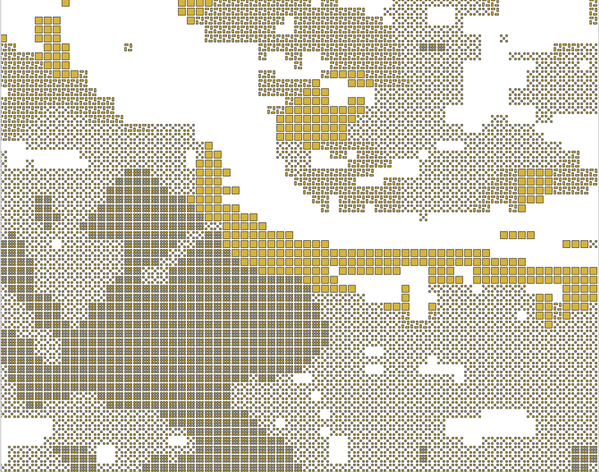
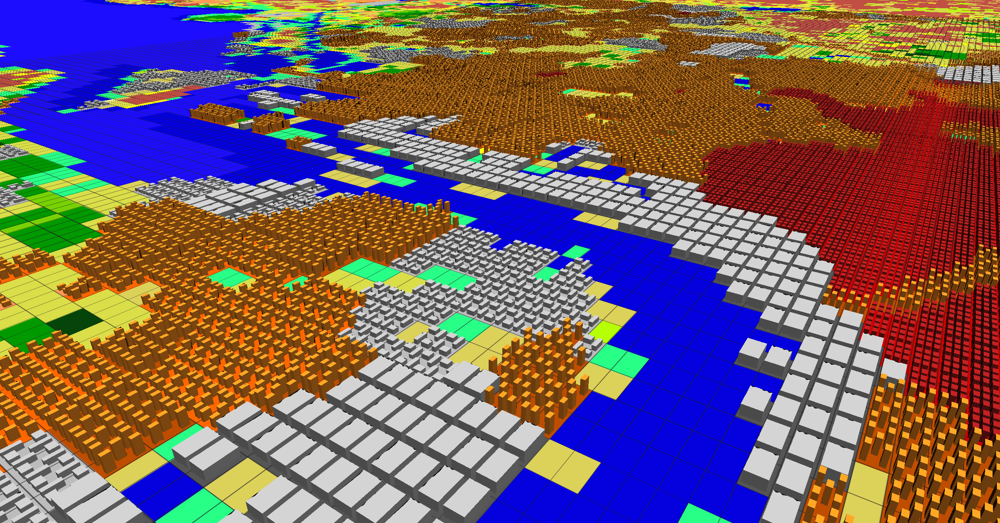

# Cityblocks

Python utility to:

- Download global LCZ map from [Demuzere et al.](https://zenodo.org/records/7670653).
- Extract an area of interest
- Generate a new dataset where each pixel is replaced by a 2D tile corresponding to the LCZ type

The generated file can be displayed in QGIS to create stunning visualizations in 3D.

## How to use

```sh
# Install the tool
pip install cityblocks

# Download global LCZ data
cityblocks download

# Extract area of interest
cityblocks extract "4.724808,52.273620,5.182114,52.458729"

# Convert LCZ data to 2d tiles
cityblocks convert
```

Then, import the dataset in QGIS and visualize it. We will add instructions and QGIS style specs to this repository shortly.

## Example output

The file generated by the cityblocks command line utility looks like this when imported in QGIS.



By extruding the surface and applying a bit of styling, we can generate images like below:



The tiles can also be combined with other map layers:


